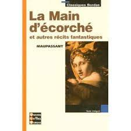
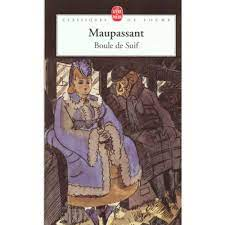
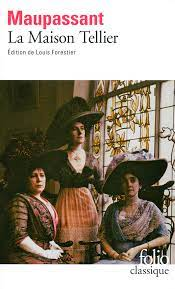
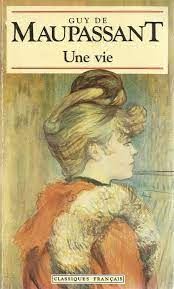
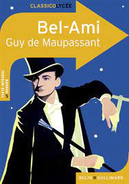
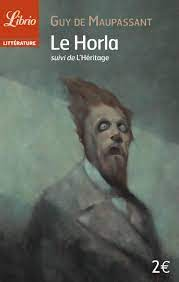
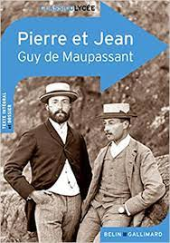
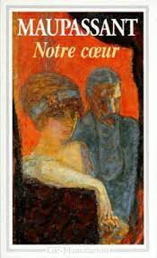

# Guy de Maupassant 👍

Guy de Maupassant, de son nom complet Henry René Albert Guy de Maupassant, est un auteur et nouvelliste français né 1850 en Normandie, et mort en 1893 de la syphilis en région parisienne. La Normandie, berceau de son enfance, de même que ses habitants, ont inspiré plusieurs de ses œuvres. Soutenu et conseillé par l’écrivain Gustave Flaubert dont il est le disciple1, il rencontra certains des principaux écrivains du XIXe siècle, comme Émile Zola, Octave Mirbeau ou encore Paul Alexis. 

### Enfance et études:

Maupassant naît le 5 août 1850 au château de Miromesnil, à Tourville-sur-Arques, en Normandie. Son père, Gustave Maupassant, et sa mère, Laure Le Poittevin, sont issus de la bourgeoisie normande et sont suffisamment aisés pour pouvoir vivre sans avoir besoin de travailler. Le régime politique de l’époque est alors le Second Empire. En 1859, la famille déménage à Paris, et Maupassant fait son entrée au lycée Impérial Napoléon la même année. À treize ans, de retour en Normandie, il entre au petit séminaire d'Yvetot, où il y restera cinq ans avant d’en être renvoyé. Il étudie alors un an au lycée de Rouen. C’est à ce moment qu’il rencontre Bouilhet et Flaubert. En 1868, il sauve de la noyade le poète Algernon Charles Swinburne. Il obtient son baccalauréat littéraire en 1869 et entame un mois plus tard des études de droit. 

### Guerre et années 70:

Quelques mois après avoir commencé ces études, Maupassant les abandonnera pour s’engager dans la guerre franco-prussienne de 1870 et travailler dans l’artillerie. Dégouté de la guerre et de son poste, il quitte l’armée au bout de 14 mois. Son vécu lui inspirera quelques nouvelles comme Boule de Suif ou encore Mademoiselle Fifi, qui paraîtront plusieurs années après. En 1872, il trouve un emploi au Ministère de la Marine, où il travaillera jusqu’en décembre 1878. À 23 ans, il rencontre Flaubert, écrivain et ami d’enfance de sa mère. Ce dernier commence à lui enseigner l’art d’écrire, en lui transmettant ses idées, en lui faisant travailler son style et son originalité. Maupassant se révèle être un très bon élève, à l’écoute de son maître, qui l’apprécie beaucoup 2. Pendant son temps libre, quand il n’écrit pas, il aime se promener en canot sur la Seine. Mais en 1876, il contracte la syphilis avec une fille rencontrée lors d’une de ces promenades. À partir de janvier 1879, il est rattaché au ministère de l'Instruction publique. Le soir, il s’adonne à l’écriture, et après avoir publié quelques écrits (contes, pièces de théâtres, poème), il est en décembre 1879 nommé officier d’Académie. Toutefois, l’un de ses poèmes (Au bord de l’eau) fait scandale lorsqu’il paraît dans un journal d’Étampes sous le titre Une fille, bien qu’il soit passé inaperçu lors de sa publication originale en 1876. Alors qu’il est convoqué à un procès pour ces vers choquants, Flaubert le soutient et plaide sa cause. Maupassant finit par obtenir un non-lieu et peut de nouveau publier son poème. 

### Succès littéraire et déclin:

Une grande part des œuvres de Maupassant participent au mouvement littéraire réaliste, qui essaie de représenter de la manière la plus proche de la réalité possible et sans rien embellir, la nature, les êtres humains et la société. Il s’inscrira également dans le mouvement naturaliste, bien qu’il soit très différent du naturalisme de Zola. Il publiera aussi quelques œuvres fantastiques.

Maupassant commence à publier des écrits, notamment des contes, en 1875, sous divers pseudonymes tels que Joseph Prunier, Chaudron du Diable, Guy de Valmont, Maufrigneuse et Un officier. En 1880, sa nouvelle Boule de Suif, inspirée de la guerre, est publiée dans le recueil Les soirées de Médan parmi d’autres écrits de Zola, Céard et Alexis entre autre. Cette nouvelle est le réel point de départ de sa réussite ascendante, et sera même qualifiée de chef d’œuvre par Tolstoï et Flaubert. Mais ce dernier meurt quelques semaines plus tard et Maupassant, bouleversé, abandonne peu à peu son poste au ministère de l'Instruction Publique et se consacre entièrement à l’écriture. Il publie alors de nombreux ouvrages tels que La maison Tellier, Une vie, Bel ami ou encore Le Horla et autres contes fantastiques, qui seront chacun couronnés de succès. Remplis de pessimisme, ces écrits reflètent le caractère angoissé de leur auteur, ses expériences et sa vision du monde.

Cependant, son état de santé ne cesse de s’aggraver au fur et à mesure des années. En 1891, il se retrouve peu à peu paralysé, il ne peut plus écrire et perd progressivement la raison. Interné en clinique en 1892, après une tentative de suicide, sa santé ne fait que se dégrader. Il sombre dans le coma et meurt le 6 juillet 1893 à Passy (à Paris), un mois avant ses 43 ans. 

### Principales œuvres:

Maupassant a publié au total cinq romans et plus de trois cents nouvelles et contes3, parmi eux : 

**Pablo Picasso:**
 

**Les Demoiselles d’Avignon:**
 

**Guernical:**
 

**Pablo Picasso:**
 

**Les Demoiselles d’Avignon:**
 

**Guernical:**
 

**Pablo Picasso:**
 

**Les Demoiselles d’Avignon:**
 

**Guernical:**
 

**Pablo Picasso:**
 

> #### Définitions;
>
> - **Bohème:** La bohème est une façon de vivre au jour le jour dans la pauvreté mais aussi dans l’insouciance. Elle correspond à un mouvement littéraire et artistique du XIXᵉ siècle, en marge du mouvement romantique plus « aristocratique ».
> - **Démiurge:** Le démiurge, ou le créateur, est la déité responsable de la création de l'univers physique dans diverses cosmogonies. Il peut désigner par extension tout créateur d'une œuvre.
