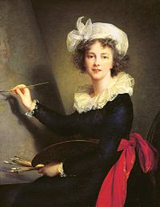
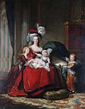

# Élisabeth Vigée Le Brun 👍

Elle est la fille du peintre pastelliste Louis Vigée, qui lui transmet son savoir, mais meurt accidentellement lorsqu'elle n'a que 12 ans. Sa mère se remarie, et Élisabeth reste liée au milieu de la peinture parisienne, où elle se distingue. La famille s'installe face au Palais Royal et la jeune fille voit affluer les commandes de portraits. À 15 ans déjà, protégée par quelques dames de la Cour, elle côtoie les plus grands personnages de son temps. Elle se marie à l'âge de 20 ans avec un marchand d'art, Jean-Baptiste-Pierre Le Brun, et a une fille, Julie.

Madame Vigée-Lebrun a peint une grande quantité de portraits durant les dernières années de l'Ancien Régime. Née la même année que la reine Marie-Antoinette, elle lui a survécu près d'un demi-siècle. Quand sonne le temps de la prise de la Bastille, l’été 1789, Élisabeth Vigée-Lebrun se trouve à Louveciennes chez la comtesse du Barry, la dernière maîtresse de Louis XV. Les deux femmes entendent le canon tonner dans Paris.

Dans la nuit du 5 au 6 octobre 1789, elle quitte la capitale avec sa fille, alors âgée de 9 ans : l’artiste part en exil à Rome, Vienne, Londres, et surtout Saint-Pétersbourg, où elle séjourne plusieurs années, recevant des commandes de la haute société russe. Elle est invitée par les grandes cours d’Europe, peignant sans cesse. Elle apprend, pendant ce temps, que tous ses amis meurent guillotinés.

En 1800, elle est rayée de la liste des émigrés et, deux ans plus tard, rentre à Paris. Madame Vigée-Lebrun publie vers 1835 ses Souvenirs, un ouvrage qui reste un document intéressant sur tous les bouleversements qu’elle a vécus. Elle s’éteint à Paris, à son domicile, à l'âge de 86 ans, ayant perdu toute sa famille, le 30 mars 1842.

**Roméo et Juliette:**
 

**La Nuit des rois:**
 

